# 🎵 Son1k v3.0 - AI Music Generation Platform

> **"From Demo to Professional Production, Powered by AI"**

[](https://github.com/your-username/son1k-v3)
[](LICENSE)
[](https://python.org)
[](https://reactjs.org)
[](https://fastapi.tiangolo.com)
[](https://docker.com)

**Son1k v3.0** is a revolutionary AI-powered music generation platform that transforms rough demos into professional productions. Built with cutting-edge technology including Facebook's MusicGen, advanced audio analysis, and professional postprocessing chains.

## ✨ Key Features

### 🎤 **Maqueta → Production Workflow** (Revolutionary)
- **Upload demos** in any format (WAV, MP3, FLAC, AIFF, M4A)
- **Advanced AI analysis** of tempo, key, energy, and vocal presence
- **Context-aware AI generation** using MusicGen with intelligent prompts
- **Professional postprocessing** with SSL EQ, Melodyne-like tuning, Neve saturation
- **A/B comparison** interface with side-by-side playback

### 🤖 **Ghost Studio** (Automated Generation)
- **Pre-configured music styles** with optimized parameters
- **Job queue system** with real-time status tracking
- **Automatic generation** with minimal user input
- **Background processing** with polling updates

### 🎛️ **Manual Generation** (Full Control)
- **Complete parameter control** over MusicGen
- **Advanced sampling options** (temperature, top-k, top-p)
- **Reproducible results** with seed support
- **Real-time generation** with progress tracking

### 📊 **Professional Audio Processing**
- **SSL-style 4-band EQ** with parametric filters
- **Melodyne-like pitch correction** with key detection
- **Neve console saturation** with harmonic enhancement
- **Professional mastering** with LUFS normalization and limiting

## 🚀 Quick Start

### Prerequisites

- **Python 3.11+**
- **Node.js 20+**
- **FFmpeg** (for audio processing)
- **Optional:** Rubberband (for better pitch shifting)

### 1. Clone & Setup

```bash
# Clone repository
git clone https://github.com/your-username/son1k-v3.git
cd son1k-v3

# Complete setup (creates venv, installs deps, creates directories)
make setup

# Install additional system dependencies
make install-deps
```

### 2. Start Development

```bash
# Start both backend and frontend
make dev

# Or individually:
make dev-backend  # API: http://localhost:8000
make dev-frontend # UI:  http://localhost:3000
```

### 3. First Generation

1. **Visit**: http://localhost:3000
2. **Try Maqueta → Production**:
   - Upload an audio file
   - Describe your vision: "transform into uplifting electronic music"
   - Get professional AI production in 60 seconds!

## 📁 Project Structure

```
son1k-v3/
├── 🐍 backend/                    # FastAPI Backend
│   ├── src/
│   │   ├── api/                   # API endpoints
│   │   │   ├── auth.py           # Authentication
│   │   │   ├── generate.py       # Manual generation
│   │   │   └── ghost.py          # Ghost Studio + Maqueta
│   │   ├── core/                 # Core configuration
│   │   ├── services/             # Business logic
│   │   │   ├── audio_analysis.py # Audio analysis engine
│   │   │   ├── audio_post.py     # Professional postprocessing
│   │   │   ├── musicgen.py       # MusicGen integration
│   │   │   └── ghost_studio.py   # Ghost Studio logic
│   │   └── main.py               # FastAPI application
│   ├── tests/                    # Comprehensive tests
│   ├── requirements.txt          # Python dependencies
│   └── Dockerfile               # Backend container
├── ⚛️ frontend/                   # React Frontend
│   ├── src/
│   │   ├── components/           # React components
│   │   ├── hooks/               # Custom hooks
│   │   ├── services/            # API clients
│   │   └── App.jsx              # Main application
│   ├── package.json             # Node dependencies
│   └── Dockerfile              # Frontend container
├── 🗄️ storage/                   # Data storage
│   ├── uploads/                 # Demo uploads
│   ├── output/                  # Generated productions
│   └── models/                  # Cached AI models
├── 🐳 docker-compose.yml         # Full stack deployment
├── 📋 Makefile                   # Development commands
└── 📚 docs/                      # Documentation
```

## 🎵 How It Works

### Maqueta → Production Pipeline

```mermaid
flowchart TD
    A[Upload Demo] --> B[Audio Analysis]
    B --> C[🎵 Tempo Detection]
    B --> D[🎼 Key Detection]
    B --> E[⚡ Energy Analysis]
    B --> F[🎤 Vocal Detection]
    
    C --> G[Build AI Prompt]
    D --> G
    E --> G
    F --> G
    
    G --> H[🤖 MusicGen Generation]
    H --> I[🎛️ SSL EQ]
    I --> J[🎯 Pitch Correction]
    J --> K[🔥 Neve Saturation]
    K --> L[🎚️ LUFS Mastering]
    L --> M[✨ Production Output]
    
    M --> N[A/B Interface]
    A --> N
```



### Technical Stack

#### Backend (FastAPI)
- **MusicGen Integration**: Facebook's state-of-the-art music generation
- **Advanced Audio Analysis**: Librosa, tempo/key detection, vocal analysis  
- **Professional Processing**: SSL EQ, Melodyne tuning, Neve saturation
- **RESTful API**: Complete OpenAPI documentation
- **Job Queue**: Background processing with real-time updates

#### Frontend (React)
- **Modern UI**: Dark/light modes, responsive design
- **File Upload**: Drag & drop with validation and preview
- **Real-time Updates**: WebSocket-like polling for job status
- **A/B Comparison**: Side-by-side audio players
- **Error Handling**: Comprehensive error boundaries

#### Audio Pipeline
- **Sample Rate**: 32kHz for memory efficiency
- **Formats**: WAV, MP3, FLAC, AIFF, M4A support
- **Processing**: SSL → Tuning → Saturation → Mastering → Fades
- **Quality**: Professional broadcast-ready output

## 🔧 Development

### Available Commands

```bash
# === Setup & Installation ===
make setup              # Complete initial setup
make install-deps       # Install system dependencies
make check-deps         # Verify dependencies

# === Development ===
make dev               # Start both servers
make dev-backend       # Backend only
make dev-frontend      # Frontend only

# === Testing ===
make test              # Run all tests
make test-smoke        # Quick smoke tests
make test-integration  # Full integration tests

# === Docker ===
make docker-up         # Start with Docker
make docker-down       # Stop Docker services
make docker-clean      # Clean Docker resources

# === Maintenance ===
make clean             # Clean cache and temp files
make format            # Format code (Black + Prettier)
make lint              # Lint code (Ruff + ESLint)
make backup            # Create backup of important data

# === Monitoring ===
make status            # Show service status
make health            # Health check
make logs              # Show recent logs
```

### Environment Configuration

#### Backend (.env)
```bash
# Copy example and customize
cp backend/.env.example backend/.env

# Key settings:
SECRET_KEY=your-secret-key
DATABASE_URL=sqlite:///./storage/son1k.db
MUSICGEN_MODEL=facebook/musicgen-small
MAX_AUDIO_DURATION=30
```

#### Frontend (.env)
```bash
# Copy example and customize  
cp frontend/.env.example frontend/.env

# Key settings:
VITE_API_URL=http://localhost:8000
VITE_MAX_FILE_SIZE=104857600  # 100MB
```

## 🧪 Testing

### Comprehensive Test Suite

```bash
# All tests
make test

# Specific test categories
make test-smoke        # Health, basic functionality
python -m pytest tests/test_api.py::TestMaquetaProduction  # Maqueta workflow
python -m pytest tests/test_api.py::TestGhostStudio       # Ghost Studio
python -m pytest tests/test_api.py::TestAudioProcessing   # Audio components
```

### Test Coverage
- ✅ **Health check** and basic API functionality
- ✅ **Manual generation** with parameter validation
- ✅ **Ghost Studio** complete workflow (presets → jobs → completion)
- ✅ **Maqueta → Production** end-to-end pipeline
- ✅ **Audio analysis** and postprocessing components
- ✅ **File upload** validation and error handling
- ✅ **Static file** serving and caching

## 🐳 Docker Deployment

### Development
```bash
# Start development environment
make docker-dev

# Services available:
# - Frontend: http://localhost:3000
# - API: http://localhost:8000
# - Docs: http://localhost:8000/docs
```

### Production
```bash
# Build and start production stack
make docker-up

# Full stack includes:
# - API (FastAPI + PostgreSQL + Redis)
# - Frontend (React + Nginx)
# - Reverse proxy with SSL
# - Monitoring and health checks
```

### Services

| Service | Port | Description |
|---------|------|-------------|
| Frontend | 3000 | React application with Nginx |
| API | 8000 | FastAPI backend |
| Database | 5432 | PostgreSQL (production) |
| Redis | 6379 | Caching and job queue |
| Nginx | 80/443 | Reverse proxy and SSL |

## 📊 Performance & Scaling

### Model Performance

| Model | Parameters | Memory | Speed | Quality |
|-------|------------|--------|-------|---------|
| **Small** | 300M | ~2GB | Fast ⚡ | Good ✓ |
| Medium | 1.5B | ~8GB | Medium | Better |
| Large | 3.3B | ~16GB | Slow | Best |

### Generation Limits
- **Duration**: 1-30 seconds (MusicGen constraint)
- **File Size**: 100MB maximum upload
- **Formats**: WAV, MP3, FLAC, AIFF, M4A
- **Concurrent Jobs**: 2 (configurable)

### Device Support
- **CUDA**: Optimal performance (if available)
- **Apple Silicon (MPS)**: Good performance
- **CPU**: Slower but functional fallback

### Typical Performance
- **Upload + Analysis**: 2-5 seconds
- **AI Generation**: 15-45s (first run includes model download)
- **Professional Processing**: 3-8 seconds
- **Total Workflow**: 30-60 seconds demo → production

## 🎨 API Documentation

### Interactive Documentation
- **Swagger UI**: http://localhost:8000/docs
- **ReDoc**: http://localhost:8000/redoc

### Key Endpoints

#### Manual Generation
```bash
POST /api/v1/generate
{
  "prompt": "uplifting electronic music",
  "duration": 8.0,
  "temperature": 1.0,
  "top_k": 250,
  "seed": 12345
}
```

#### Maqueta → Production
```bash
POST /api/v1/ghost/maqueta
# Multipart form:
# - file: audio file
# - prompt: transformation description
# - duration: target length
# - processing parameters (EQ, saturation, etc.)
```

#### Ghost Studio
```bash
# Get presets
GET /api/v1/ghost/presets

# Create job
POST /api/v1/ghost/job
{
  "preset": "latin_rock",
  "prompt_extra": "with saxophone solo",
  "duration": 15.0
}

# Monitor jobs
GET /api/v1/ghost/jobs
```

## 🎯 Use Cases

### For Musicians & Producers
- **Demo Enhancement**: Transform phone recordings into professional tracks
- **Style Exploration**: Experiment with different genres and moods
- **A/B Testing**: Compare original ideas with AI interpretations
- **Rapid Prototyping**: Quick musical sketches for further development

### For Content Creators
- **Background Music**: Generate custom tracks for videos and podcasts
- **Jingles & Intros**: Create branded audio content
- **Mood Music**: Ambient tracks for streams and presentations
- **Sound Design**: Musical elements for multimedia projects

### For Developers & Researchers
- **API Integration**: Embed music generation in applications
- **Research Platform**: Study AI music generation techniques
- **Educational Tool**: Learn about audio processing and AI
- **Extensible Framework**: Build custom music applications

## 🔧 Customization & Extension

### Adding Custom Presets
Edit `backend/data/presets.json`:
```json
{
  "my_preset": {
    "name": "My Custom Style",
    "description": "Custom music style",
    "prompt_base": "your prompt here",
    "suggested_bpm": 128,
    "suggested_duration": 10,
    "parameters": {
      "temperature": 1.1,
      "top_k": 200
    }
  }
}
```

### Custom Audio Processing
Extend `AudioPostProcessor` class:
```python
def custom_effect(self, audio):
    # Your custom processing
    return processed_audio
```

### Frontend Customization
- **Themes**: Modify `themeColors` in `App.jsx`
- **Components**: Add new tabs or features
- **Styling**: Use Tailwind CSS classes (if enabled)

## 🛠️ Troubleshooting

### Common Issues

#### Model Loading Problems
```bash
# Clear model cache
make clean
curl -X DELETE http://localhost:8000/api/v1/cache

# Check available memory
make monitor
```

#### Audio Processing Errors
```bash
# Install missing dependencies
brew install ffmpeg rubberband  # macOS
sudo apt install ffmpeg librubberband-dev  # Ubuntu

# Verify installation
ffmpeg -version
python -c "import librosa, pyloudnorm; print('OK')"
```

#### Upload Issues
- **File too large**: Max 100MB per upload
- **Unsupported format**: Use WAV, MP3, FLAC, AIFF, M4A
- **Corrupted file**: Try re-exporting from your audio software

#### Performance Issues
- **Slow generation**: Use `musicgen-small` model (default)
- **Memory errors**: Reduce `duration` or close other applications
- **CPU bottleneck**: Consider upgrading to GPU-enabled setup

### Development Issues

#### Backend Won't Start
```bash
# Check Python version and virtual environment
python --version  # Should be 3.11+
source .venv/bin/activate

# Install dependencies
pip install -r backend/requirements.txt

# Check configuration
make validate-env
```

#### Frontend Issues
```bash
# Clear Node cache
cd frontend
rm -rf node_modules package-lock.json
npm install

# Check Node version
node --version  # Should be 20+
```

#### Docker Issues
```bash
# Clean and rebuild
make docker-clean
make docker-build
make docker-up

# Check logs
make docker-logs
```

## 🚀 Production Deployment

### Environment Setup
1. **Database**: Use PostgreSQL instead of SQLite
2. **Redis**: For caching and job queue
3. **Storage**: External storage for generated files
4. **Monitoring**: Add logging and health checks
5. **SSL**: Configure HTTPS with certificates

### Security Considerations
- Change default `SECRET_KEY`
- Configure proper CORS origins
- Use environment variables for sensitive data
- Implement rate limiting
- Regular security updates

### Scaling Options
- **Horizontal**: Multiple API instances behind load balancer
- **GPU Scaling**: Dedicated GPU instances for generation
- **Storage**: External storage (S3, GCS) for generated files
- **CDN**: Content delivery for static assets

## 🤝 Contributing

We welcome contributions! Please follow these steps:

1. **Fork** the repository
2. **Create** a feature branch: `git checkout -b feature/amazing-feature`
3. **Test** your changes: `make test`
4. **Format** code: `make format`
5. **Commit** changes: `git commit -m 'Add amazing feature'`
6. **Push** to branch: `git push origin feature/amazing-feature`
7. **Open** a Pull Request

### Development Guidelines
- Follow existing code style (Black for Python, Prettier for JS)
- Add tests for new features
- Update documentation as needed
- Use conventional commit messages

## 📜 License

This project is licensed under the MIT License - see the [LICENSE](LICENSE) file for details.

## 🙏 Acknowledgments

- **[MusicGen](https://github.com/facebookresearch/musicgen)** by Facebook Research
- **[Librosa](https://librosa.org/)** for audio analysis
- **[FastAPI](https://fastapi.tiangolo.com/)** for the backend framework
- **[React](https://reactjs.org/)** for the frontend
- **[Transformers](https://huggingface.co/transformers/)** by Hugging Face

## 📞 Support & Contact

- **Documentation**: Check `/docs` folder and API docs at `/docs`
- **Issues**: Open an issue on GitHub for bugs or feature requests
- **Discussions**: Use GitHub Discussions for questions and community
- **Email**: contact@son1k.com (if applicable)

## 🗺️ Roadmap

### v3.1 (Coming Soon)
- **Audio Conditioning**: Generate music based on reference audio
- **Multi-track Generation**: Separate instrument tracks
- **Real-time Streaming**: WebSocket-based real-time generation
- **Advanced Presets**: More sophisticated music style templates

### v3.2 (Future)
- **Plugin System**: Support for custom audio effects
- **Collaboration**: Multi-user sessions and sharing
- **Mobile App**: iOS and Android applications
- **Cloud Deployment**: One-click cloud deployment options

---

**Built with ❤️ for the global music community**

*Son1k v3.0 - Democratizing music production through AI*